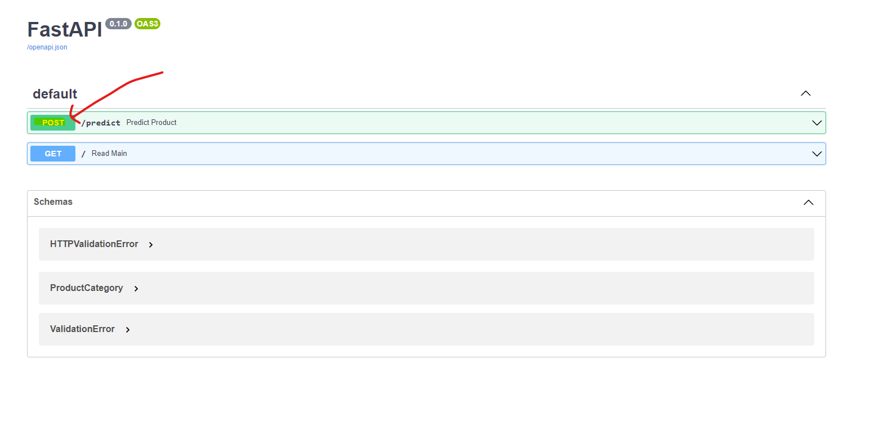
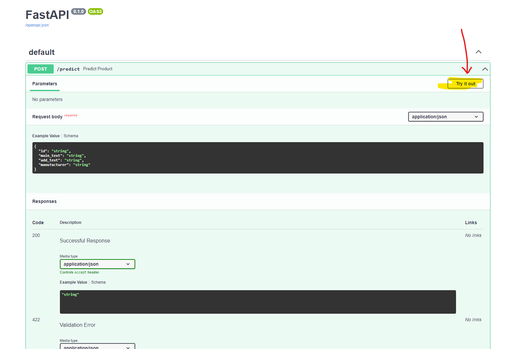
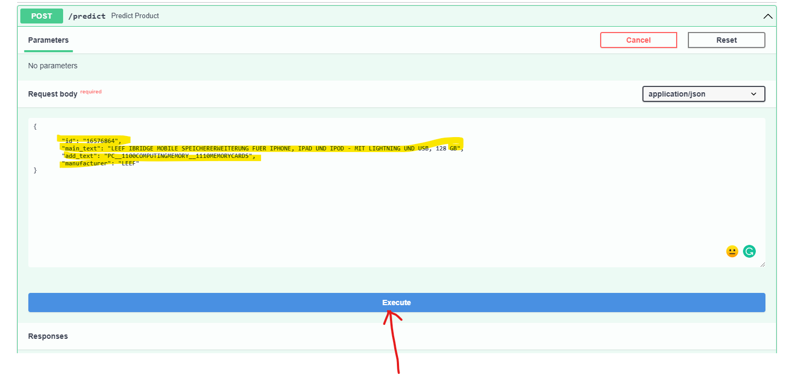
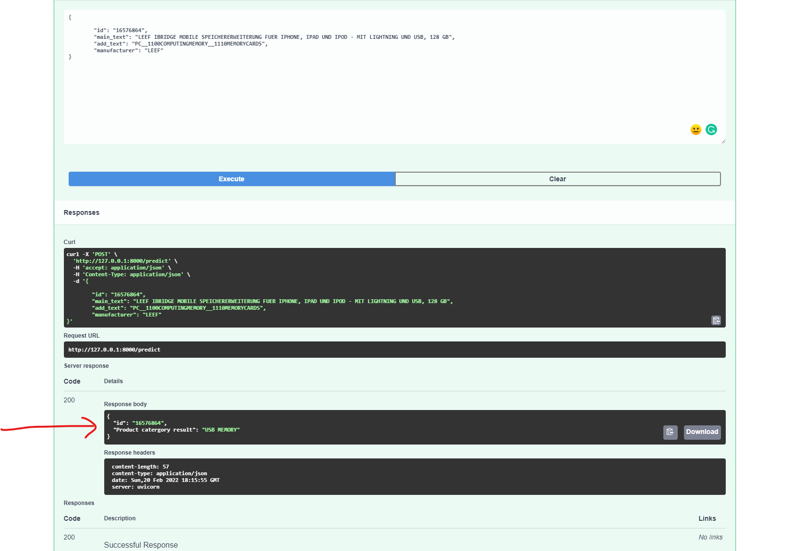

## The following steps are taken during the project
1. All the analysis and the initial EDA is done in the ".ipynb" file.
2. This file tell the decision taken by me in order to build the model and choose the best one.
3. This file has shows all the features, the statistical analysis and the model's performance
4. All the graphs, model evaluation and the confusion matrix graphs are present in this notebook file.  

 

## The Structure of the project folder: 

├── input  
│ ├── testset_C.csv 
│  
├── src 
│ ├── init.py 
│ ├── train.py 
│ ├── ProductInformation.py 
│ ├── app.py 
│ ├── models.py 
│ ├── config.py 
│ └── model_dispatcher.py 
├── models 
│ ├── feature.pkl 
│ └── Production_Prediction_Model.pkl 
├── notebooks 
│ ├── EDA and Model selection.ipynb 
├── testcases 
│ ├── init.py 
│ ├── model_inference_test.py 
├── README.md 
└── LICENSE 

 

|Folder name|Description|
|:-------:|:------:|
|input | This folder consists of all the input files and data for your machine learning project. |
|src| We will keep all the python scripts associated with the project here.|
|models| This folder keeps all the trained models.|
|notebooks| All jupyter notebooks (i.e. any *.ipynb file) are stored in the notebooks folder.|
|README.md| This is a markdown file to describe project |
|LICENSE| This is a simple text file that consists of a license for the project|

 
 

|Files|Description|
|:-------:|:------:|
|app.py | This script will create the rest api for our model. We are using FastAPI here.|
|config.py| This script holds all the config related information for our models and paths.|
|model.py| This script is used trained models.|
|model_dispatcher.py| This script has all the models and there specific hyperparameters|
|ProductionInformtion.py| This is a basemodel file for pydantic which will hold the datatype we receive from the rest api |
|model_inference_test.py| This script has all the test cases written for our model and api|

 

## If you are using an IDE like PyCharm: 
1. Go to "src/app.py" and directly run the file.  
2. Click on the URL which would be http://127.0.0.1:8000/doc . 
3. This will open a swagger UI which is nice interface to test the api.  
4. In the UI please follow the steps as follows:  
    a. Click on the "POST" button to predict the data you want to test   
      
    b. Click on the "Try it out" button.  
     
    c. In the "Request body" section enter json payload as shown in the image. Make sure the structure of payload is maintained.  
     
        *Note: make sure to add the data in all the fields. If not, you will recieve a message as "Insufficient data for classification"  
    d. Click on the "Execute" button and the results will be shown under the "Responses" section as shown below  
     

 

## How to run rest api the code from command line 
1. uvicorn app:app --reload   
2. open the link : http://127.0.0.1:8000/doc   
3. Follow the same steps as mentioned above. 